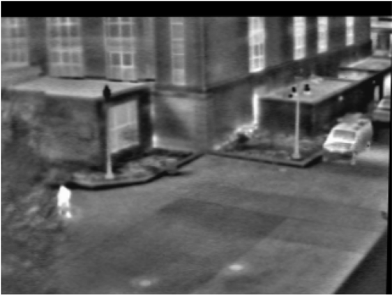
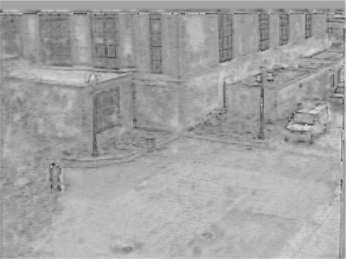

# Infrared-to-Grayscale

## What

In this repository, I have created a simple backpropagation network which tries to predict the Grayscale image given its Infrared counterpart.
No prior knowledge of thermal ambience is required to build and understand this model which is a plus.
The results show that this approach can retrieve a sizable amount of visible specturm information of the object.

## Why

All objects emit electromagnetic radiation, primarily in the Infrared (IR) wavelength, which cannot be seen by the naked eye. In areas where adequate lighting 
conditions are absent, this radiation plays as a important source of information and has many use cases. Hence the challenge is to map this relatively
little information (infrared) into a high-dimensional feature space (visible range / grayscale) which we have done using backpropagation network.

## How

In brief we did the following:
- Created a new tablular dataset from the initial imges dataset by preserving local dependencies.
- Experimented with different ANN architectures and chose the one which gave the least mean squared error.
- Applied postprocessing image processing techniques like Gaussian blurring and Laplacian high pass filtering to enchance the predicted images.    

For complete information refer [this](Report.pdf) project report.

## Conclusion

The results can be seen below. The images are Grayscale, Infrared and Predicted Grayscale image (from left to right)   

